# **Lab 10 - Implement prompt action for a quiz generation agent’s topic**

**Objective :**

Prompt actions are one of the ways to extend Microsoft Copilots. They do
this by creating business specific natural language actions. The actions
are interpreted by the GPT model to perform the necessary action as
instructed. These actions are wrapped within a AI plugin definition,
which copilots can invoke at runtime when a matching intent or utterance
is encountered.

In this lab, you will learn to create a prompt action for a quiz
generation topic which will generate quiz questions based on a given
topic.

Estimated duration - 40 minutes

## **Exercise 1: Use natural language to create an agent**

1.  Open a browser and login to
    +++https://copilotstudio.microsoft.com/+++ and login with the
    below credentials.

    - Username - +++@lab.CloudPortalCredential(User1).Username+++

    - TAP - +++@lab.CloudPortalCredential(User1).TAP+++

2.  From the **Home page**, in the text area - Start building by
    describing what your agent needs to do, enter +++I want you to be a
    question and answering assistant that can answer common questions
    from users using the content of a website+++ and click on **Send**.

    

3.  The agent gets created as per the requirements

    

4.  Scroll down and select **+ Add knowledge** under the Knowledge
    section.

    

5.  Select the **Public websites** option.

    

6.  Enter +++[www.microsoft.com+++](http://www.microsoft.com+++/) and
    select **Add**.

    

7.  Select Add to agent.

    

8.  The website is added as a knowledge source to the agent.

    

9.  Click on **Test** icon to Test the agent. Enter +++What is Copilot
    Studio?+++ and hit **Enter**.

    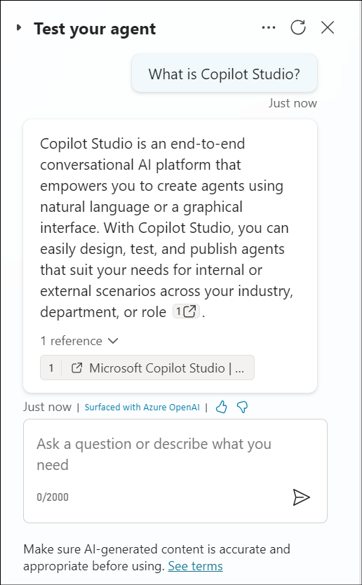

10. Enter +++What is the latest xbox model?+++

    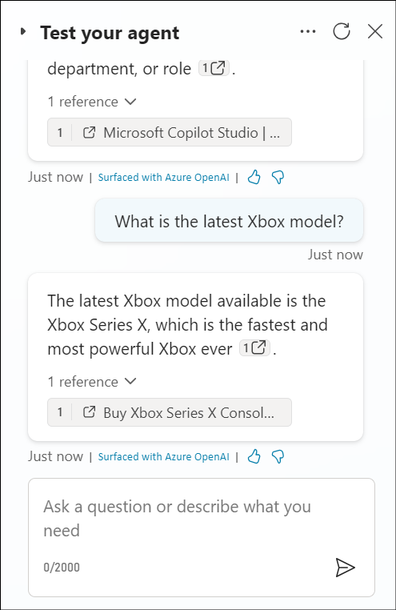

For both the above questions, you will get an answer from the agent
which will be a generic one since the agent will be using its general
knowledge.

## **Exercise 2: Create a Prompt action for a Topic for generative
answers**

Use **prompt** in **Copilot Studio** to natural language actions as
copilot extensions. These actions use the generative AI models from AI
Builder and natural language understanding to address specific scenarios
for your copilots. This means you can extend the capabilities of your
copilots by simply creating natural language based prompt actions.

In this exercise, you will learn how to add a prompt to action to a
topic node

1.  In your agent select the **Topics** tab, select **+ Add a
    topic** and select **From blank**.

    

2.  Enter the name for the Topic as +++Generate questions for a quiz+++.
    Enter the below details in
    the **Description**(Select **Copy** option and paste it in
    the **Description** area).

    ```
    - create a number of questions for a quiz based on a topic and format
    the quiz based on the instruction provided

    - creates a quiz with a number of questions based on the topic provided
    and formats the quiz

    - generate a quiz with a number of questions using the topic provide and
    format the questions

    - creates questions for a quiz on a specific topic and format

    - format a quiz by a number of questions based on the topic provided
    ```

    Select **Save** on the top right to save the topic.

    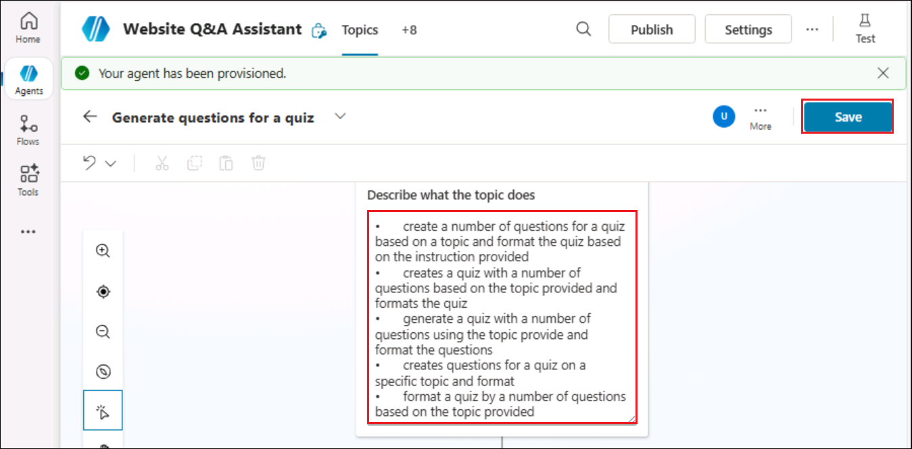

3.  Click on the **+** symbol below the Trigger node. Select the **Add a
    tool** option and select **New prompt** option under that.

    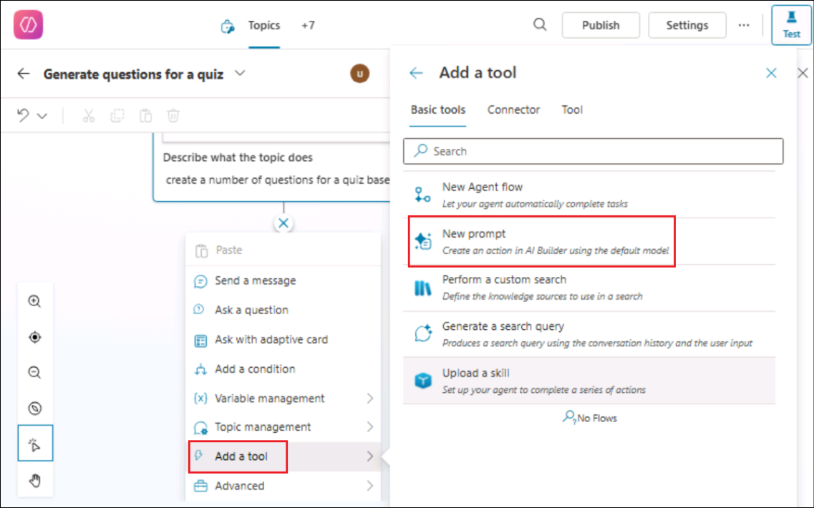

4.  The Prompt dialog will appear, and you may see a flyout appear that
    will guide you on how to create your prompt. Select **Next** to go
    through the guide.

5.  We'll create prompt that will generate questions for a quiz. Enter
    the name for the prompt as +++Quiz Generator@lab.LabInstance.Id +++.

6.  Paste the below content in the Prompt field.

    +++Generate a quiz with [number] questions to cover this [topic].
Decide on the format, such as multiple-choice questions or true/false
statements. Use this [format]. Designate the correct answer within
parentheses.+++

    Select [number], expand **+ Add context** section and select **Text**.

    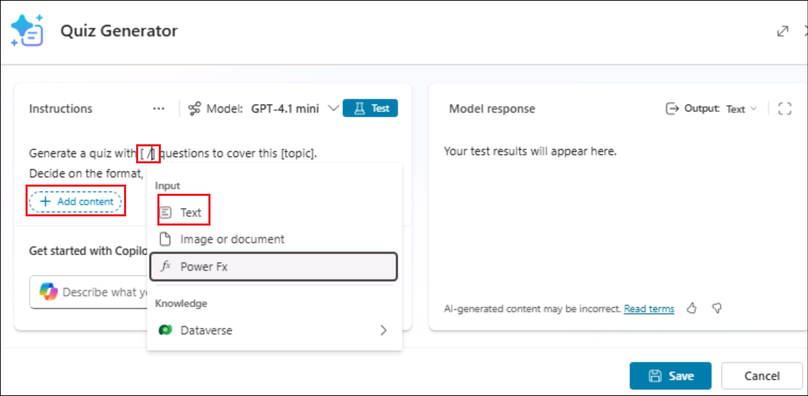

7.  Enter the name as +++number+++ and enter sample data such as
    +++5+++. Select **Close**.

    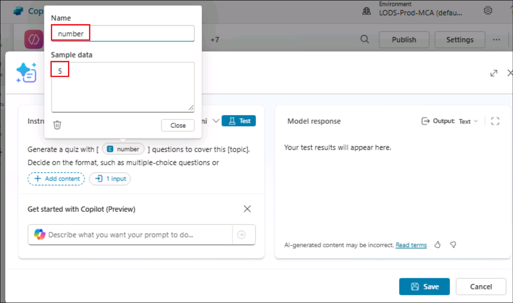

8.  Select **[topic]**, expand **+ Add context** section and
    select **Text**. Enter the name as +++topic+++ and enter sample data
    such as +++Science+++.

    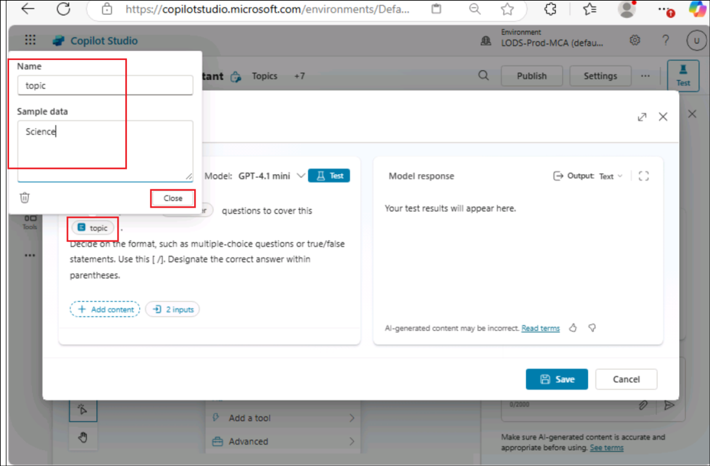

9.  Select **[format]**, expand **+ Add context** section and
    select **Text**.Enter the name as +++format+++ and enter sample data
    such as +++bullet points+++. Select **Save** in the Prompt window

    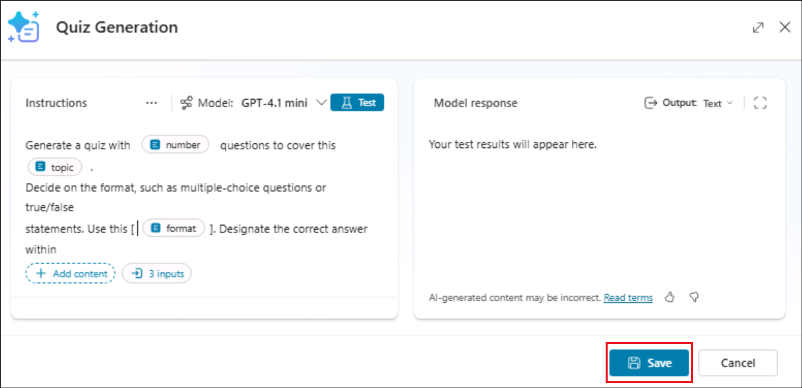

10. The prompt action node will now appear in the authoring canvas of
    the Topic. Next, the values of the input parameter need to be
    defined in order for the agent to populate them. Select
    the **...** icon

    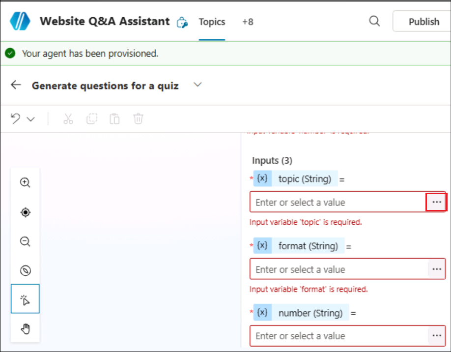

11. Select the **System** tab and select the **Acivity.Text** as the
    input value for the action to use the user’s entire response and
    identify the format value.

    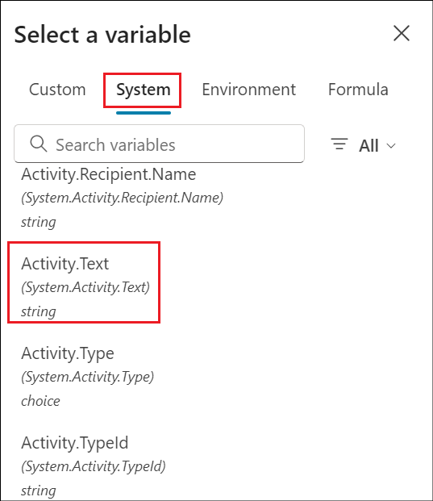

12. Repeat the same for the remaining input parameters of the prompt
    action.

    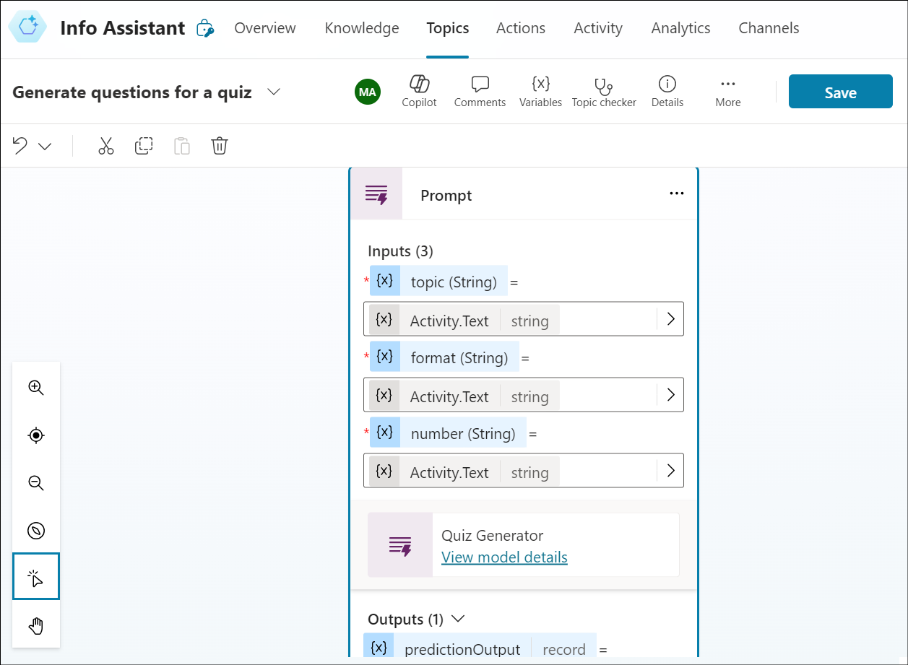

13. Next, we need to define the output variable of the prompt action.
    This is so that the response can be referenced downstream in the
    topic. Select the **\>** icon and in the **Custom** tab,
    select **Create new** and name the variable as
    +++**VarQuizQuestionsResponse**+++.

    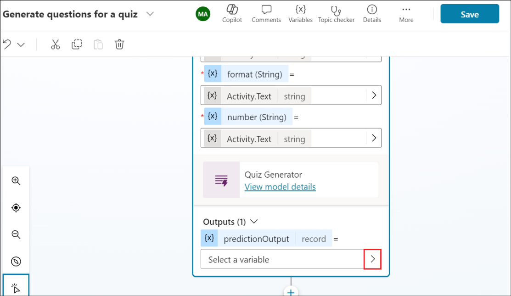

    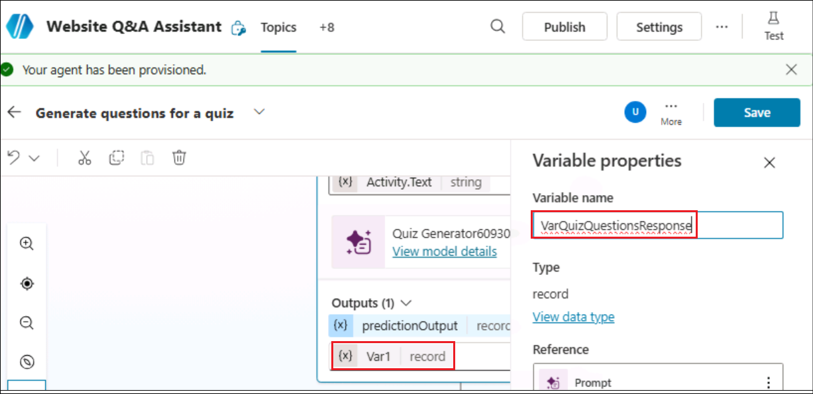

    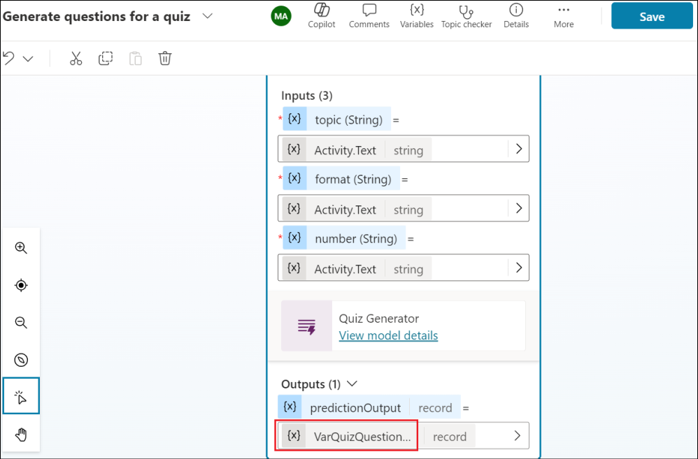

14. Below the Prompt action, select the **+** icon to add a new node and
    select **Send a message**. Select the **{x}** variable icon.

    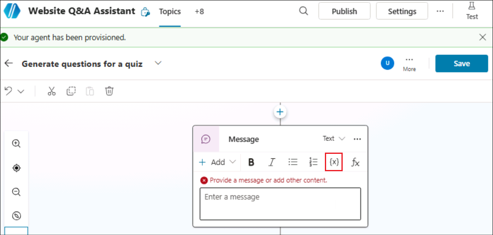

15. Select the variable **VarQuizQuestionsResponse.text**. This will add
    the text property of the prompt action response to the send a
    message node. Select **Save** to save your topic.

    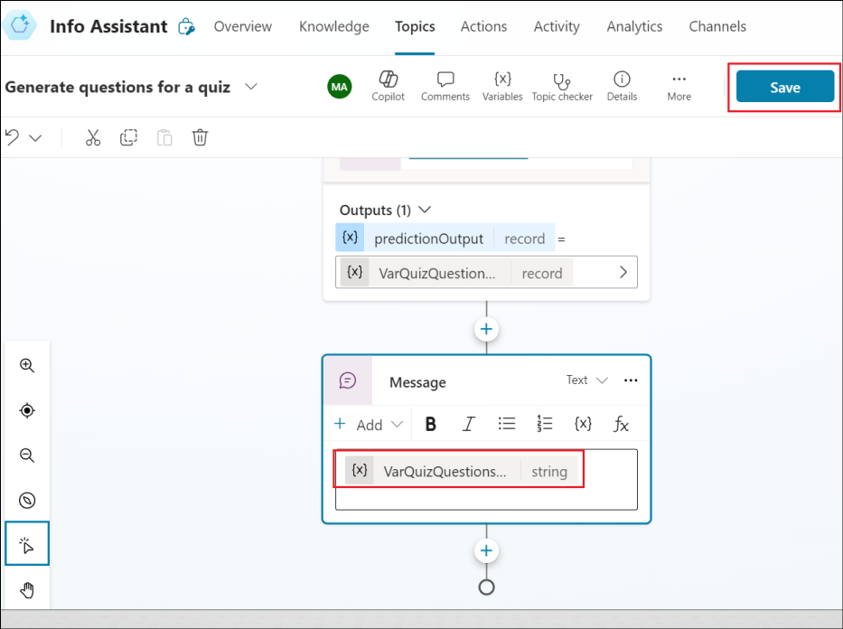

16. The Topic details need to be updated next which will be used by your
    agent to associate the topic with the user's intent when Generative
    mode is enabled. Select **Details** and enter the following.

    - Display name - +++generate questions for a quiz+++

    - Description - +++This topic creates questions for a quiz based on
      the number of questions, the topic and format provided by the
      user+++

    Select **Save** to save your topic.

    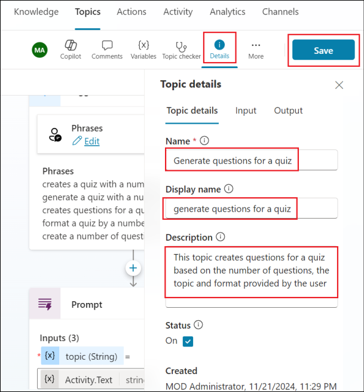

17. Now we are ready to test the agent. Open the Test pane, and enter
    the following question and observe the output.

    +++Create 5 questions for a quiz based on geography and format the quiz
as multi choice+++

    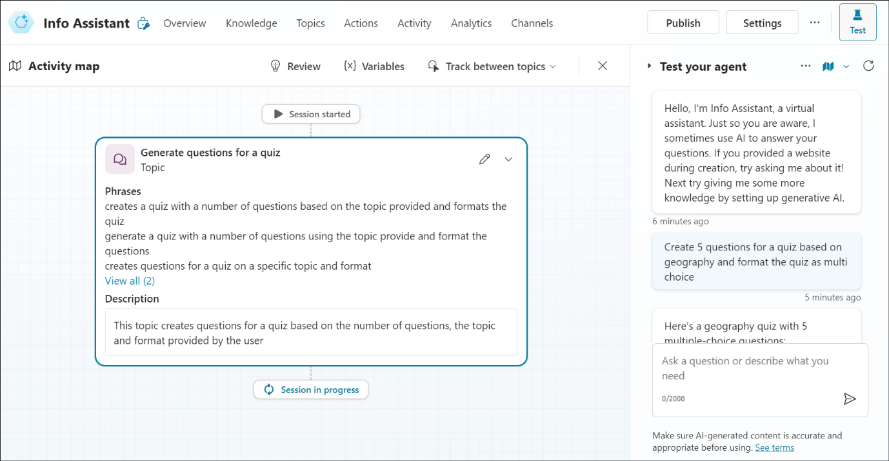

    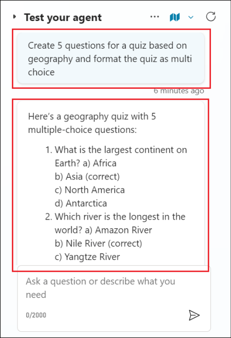

**Summary**

In this lab, we have learnt how to create a prompt action for a topic by
creating a custom prompt and test it.
