# **Lab 9 - Streamlining IT Support Operations with Autonomous Copilot Agent using Copilot Studio**

**Estimate Time: 60 mins**

**Objective**

The objective of this lab is to enable participants to streamline IT
support operations at Contoso Solutions by creating an autonomous
Copilot agent. Participants will learn to set up Microsoft Copilot
Studio, configure the IT Support Agent, integrate Power Apps and
Dataverse, enhance the bot’s capabilities with a knowledge base, and
automate ticket creation using Power Automate. This hands-on lab will
equip users with the skills to improve IT workflows, reduce manual
effort, and enhance support efficiency.

**Solution**

Participants will create a customized Contoso IT Support Agent using
Microsoft Copilot Studio, configure it to handle common IT issues, and
integrate it with Dataverse for storing support data. They will set up a
development environment, add knowledge sources, and refine the bot's
conversation flows for better user interaction. By leveraging Power
Apps, participants will create a Dataverse table to manage IT support
records. Using Power Automate, they will automate ticket creation and
email notifications for unresolved issues. Finally, participants will
test the agent to validate its troubleshooting accuracy and workflow
automation, ensuring seamless IT support operations.

## **Exercise 1: Getting Started with Power Apps**

This exercise introduces participants to Power Apps and Dataverse. The
goal is to log in to Power Apps, set up a working environment, and
create a Dataverse table by importing data from an Excel file.
Participants will learn essential skills for working with data-driven
applications.

### **Task 1: Logging into Power Apps**

1.  Navigate to power apps website
    +++https://www.microsoft.com/en-us/power-platform/products/power-apps+++ and
    click on the **Try for Free** button.

    

2.  Enter
    the **Username**, +++@lab.CloudPortalCredential(User1).Username+++. **select** the **checkbox** and
    click on the **Start free** button. Select country of origin.

    

3.  Enter the Temporary Access Pass
    - +++@lab.CloudPortalCredential(User1).TAP+++

    

4.  Select **Get Started**.

    

### **Task 2: Update the Developer environment settings**

1.  From a new tab in the browser, open Power Platform admin center -
    +++https://admin.powerplatform.microsoft.com/home+++ and sign in
    using your login credentials if prompted.

    - +++@lab.CloudPortalCredential(User1).Username+++

    - +++@lab.CloudPortalCredential(User1).AccessToken+++

    

2.  Select **Manage** from the left pane and select **+
    New** under **Environments**.

    

3.  Provide the environment name as +++Dev One+++ and select the Type
    as **Developer** and select **Next**.

    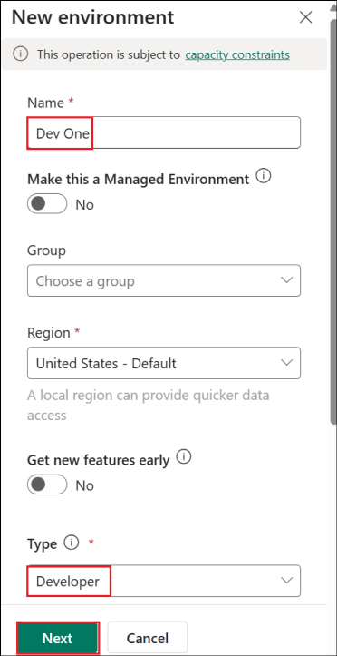

4.  Select **Save** in the **Add Dataverse** dialog.

    

5.  Once the environment is **Ready**, select the created **Dev
    One** environment.

    

6.  Click on **Edit** to edit the Settings.

    

7.  In the Edit pane, toggle **Administration mode** to **ON** and
    select **Save**.

    

    

    

8.  Once the edited changes are saved, select **Settings**.

    

9.  Select **Product - Features**.

    

10. Under the **Features**, toggle on **Dataverse search**,
    select **save**, then toggle **Single table search** option to On
    and select **Save**.

    

    

### **Task 3: Setting Up a Dataverse Table**

1.  Navigate back to the **PowerApps page** and select
    the **DevOne** environment from the list of environments.

    

2.  From the left navigation bar select **Tables.** In the tables
    section top bar click on the **+ New table** and then
    select **Create new tables**.

    

3.  Select **Import an Excel file or CSV** option to create a new table.

    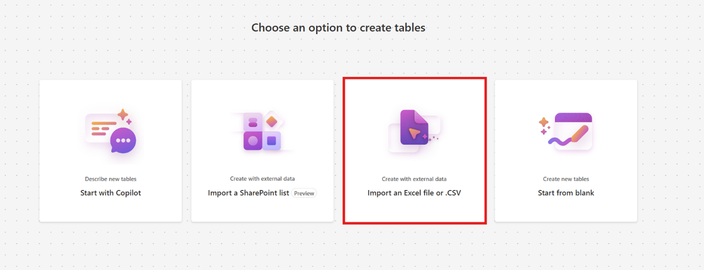

4.  Click on the **Select form device** option and select **Support
    Ticket** excel file from **C:\LabFiles\Labfiles\Autonomous
    agent** folder.

    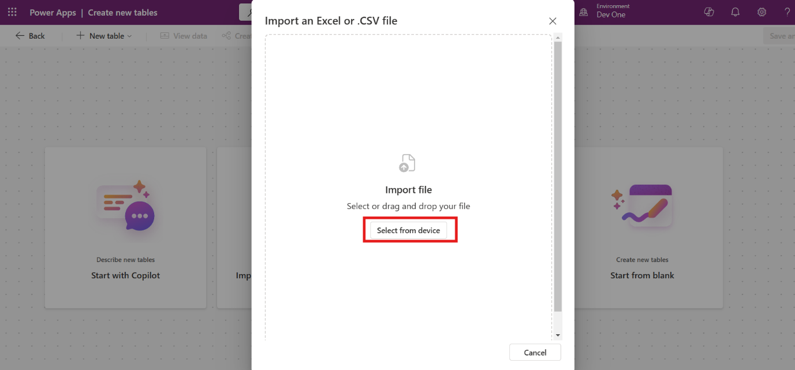

5.  Select **Import** in the next screen.

    

6.  Select the table and click on **View data** to see the data.

    [!Note] **Note:** In this case, the table is named *Employee Support
Ticket*. The name may vary with each execution. Please save the table
name for future reference. The column name may also vary in the
execution.

    

7.  Go to table data, select the drop down next to the **Issue
    Description** field, select **Edit column**, Set the data type
    as **Text** 🡪 **Multiple line** 🡪 **Plain Text** and click on
    the **Update**. The column name may be different in each case.

    [!Note] The **column name might be slightly different**, but it will
be something similar to the issue description since it is Copilot
generated.

    

    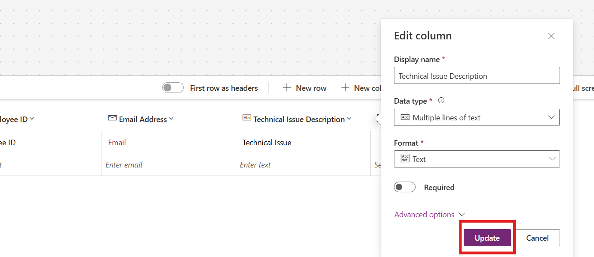

8.  Select drop down next to the **Ticket Status** field, select **Edit
    column**, Set the Choices as +++Unresolved+++, +++Resolved+++,
    +++Processing+++. Set Default choice as **Unresolved** and click on
    the **Update**.

    

9.  From top right side click on **Save and exit** to save the table.

    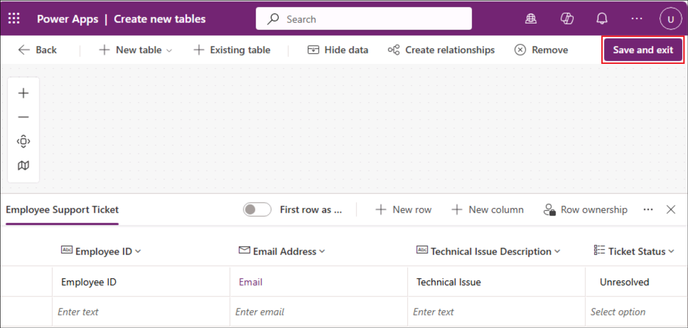

### **Task 4: Add a file to the OneDrive**

1.  From the top left of the Power Apps page, select the menu and
    select **OneDrive**.

    

2.  Select **My files** - **+ Create or upload**.

    

3.  Select **Files upload**.

    

4.  Choose **IT Support.xlsx** from **C:\LabFiles\Labfiles**.

    

5.  This file will be used in a later exercise.

    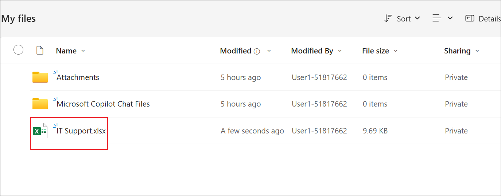

**Conclusion**

By completing this exercise, participants will learn:

- How to access and navigate Power Apps using office 365 admin tenant
  credentials.

- Steps to create and configure a Dataverse table by importing data.

- Practical knowledge of setting up an environment to support app
  development workflows.

## **Exercise 2: Creating the Contoso IT Support Agent**

This exercise focuses on logging into Microsoft Copilot Studio and
creating a customized Copilot agent tailored for IT support operations
at Contoso. Participants will gain hands-on experience navigating
Copilot Studio, configuring environments, and building an AI-powered
agent to streamline IT workflows.

### **Task 1: Creating and Configuring Contoso IT Support Agent**

1.  From a new tab, login to
    +++https://copilotstudio.microsoft.com+++/ using
    your login credentials. Select **Get Started**.

    

2.  Select **Skip** in the Welcome popup.

    

3.  Navigate to the Copilot Studio tab
    +++https://copilotstudio.microsoft.com+++ and
    choose **DevOne** environment.

    

    [!Alert] **Important:** If the Copilot Studio and does not show up the
option to select **Environment** as in the below screenshot, then follow
the below steps.

    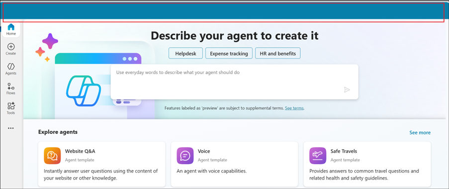

Open +++https://admin.powerplatform.microsoft.com/+++.
Select **Manage** -> **Environments** -> **Dev env** and select the
value of the **Environment ID**.

    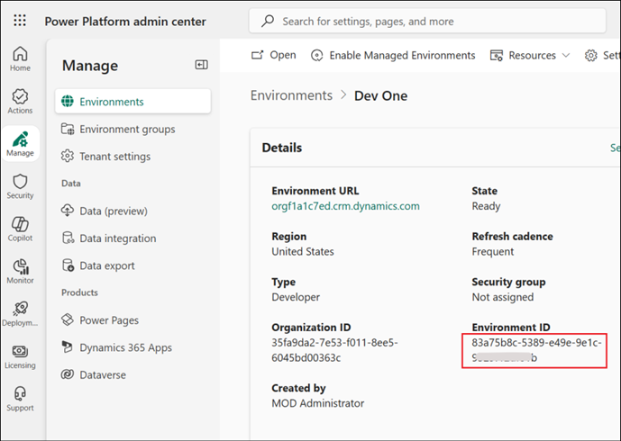

    Navigate back to the Copilot Studio tab and open
+++https://copilotstudio.microsoft.com/environments/< EnvironmentID >+++ (Replacing **<EnvironmentID >** with the value fetched above)

4.  Select **Create an agent**.

    

5.  Select **Edit**.

    

6.  Enter **Name** and **Description** as below and select **Save**.

    **Name:** +++Contoso IT Support Agent+++

    **Description** (Select the **Copy** option and **Paste** it in
    the **Description** field):

    Create a Contoso IT Support Agent which transforms IT support at Contoso
    Solutions by providing instant troubleshooting for common issues,
    automating ticket creation for unresolved problems, and storing all
    interactions in Dataverse. This solution enhances response times,
    reduces manual workloads, and boosts employee productivity.

    

7.  Select **Edit** against the Instructions to give the instructions
    for the agent.

    

8.  Enter the **instruction** and select **Save**.

    **Instruction**(Select the **Copy** option and **Paste** it in
the **Instruction** field):

    Create the Copilot Agent and configure it to handle IT support
operations. Add a knowledge source containing solutions for common IT
issues like hardware troubleshooting, connectivity, and software
glitches. Set up a trigger to detect updates to a OneDrive file
describing unresolved issues. Create an action to save these technical
issues into a Dataverse table, ensuring all details are stored for
tracking and reporting. Test the agent to validate its troubleshooting
accuracy and ticket automation workflow before deployment.

    

9.  From top right corner of the agent, click on
    the **Settings** button.

    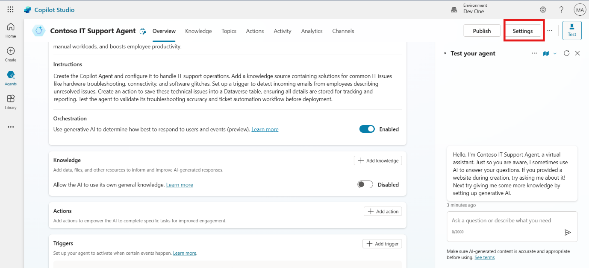

10. Scroll down and disable the **Allow ungrounded responses** option
    and **Use information from the web** under the **Knowledge** section
    and then click on **Save**.

    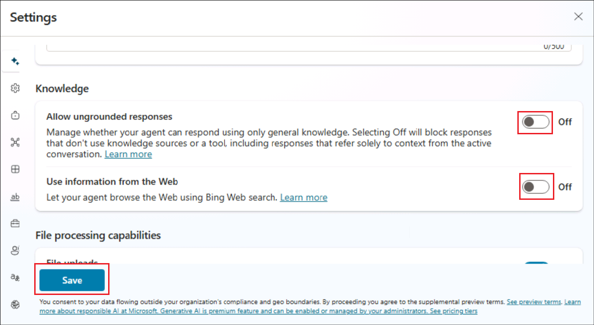

11. Once **saved**, **close** the Settings pane.

    

**Conclusion**

By completing this exercise, participants will learn:

- How to access and set up Microsoft Copilot Studio.

- Steps to create and configure a custom Copilot agent.

- Practical skills in enabling generative AI and orchestrator settings
  for the agent.

- Ways to enhance IT operations by automating ticket creation and
  leveraging AI for troubleshooting.

## **Exercise 3: Enhancing Bot Capabilities**

This exercise focuses on enhancing the capabilities of the Contoso IT
Support Agent by adding a knowledge base and customizing bot topics for
improved interaction. Participants will refine the bot's responses and
ensure it effectively assists users in troubleshooting and escalation.

### **Task 1: Add Knowledge Base**

1.  On the Contoso agent overview page, scroll down and click on **+ Add
    Knowledge** button.

    

2.  Select **Upload file** to add the lab file **Contoso Common IT
    Issue.docx** from **C:\LabFiles\Labfiles\Autonomous agent** folder
    and then click on **Add to agent** to save the file.

    

    

3.  Again, go to agent overview page, scroll down and click on **+ Add
    knowledge.**

    

4.  Select **Dataverse** option as data source.

    

5.  Search for +++Employee+++, select **Employee Support Ticket** table.
    Then select **Add to agent** button to add the knowledge source.

    [!Note] The **table name might be different** in your case since it is
a Copilot generated one. Try searching for +++Support Ticket+++ if
needed.

    

    [!Alert] **Important:** From the Knowledge page, ensure that the added
knowledge source has been successfully uploaded. This will generally
take 10 to 15 30 minutes to complete.

### **Task 2: Customize the Fallback Topic**

1.  From the top bar option click on **Topics**, select **System** and
    then click and open **Fallback** topic.

    

2.  Scroll down and go to message node. Update the message as given
    below:

    +++I’m sorry. This information is not available in my system. You can
raise the support ticket via mail for this issue.+++

    

3.  From top right side click on the **Save** button to save the topic.

    

**Conclusion**

By completing this exercise, participants will learn:

- How to upload and integrate a knowledge base to enhance the bot's
  functionality.

- Steps to customize conversation start messages for a more engaging
  user experience.

- Techniques to update fallback responses for better handling of
  unsupported queries.

## **Exercise 4: Test the agent**

This exercise guides participants through testing the Contoso IT Support
Agent to validate its functionality. Participants will check how the bot
handles prompts using the knowledge base and fallback topics to ensure
seamless interaction and escalation.

1.  From top right corner click on the **Test** button.

    

2.  Enter the prompt +++My printer is not working how to fix it+++ . It
    gives the solution as per knowledge source.

    

**Conclusion**

By completing this exercise, participants will learn:

- How to test and activate an AI agent for troubleshooting.

- Validation of the bot’s ability to respond using its knowledge base.

## **Exercise 5: Automating Support Ticket Creation with Power Automate**

This exercise demonstrates how to automate support ticket creation using
AgentFlow and integrate it with the Contoso IT Support Agent.
Participants will create a flow to streamline issue reporting and record
data in Dataverse.

1.  Select **Flows** from the left menu bar of the agent.

    

2.  Select **+ New agent flow**.

    

3.  Search for and select +++**When an agent calls the flow**+++ trigger
    under **Skills**.

    

4.  Select **Add an Input**.

    

5.  Select **Text** as data type of input and rename the input as
    +++Name+++.

    

    

6.  With same procedure create more input as per given below details.

    | **Input Name**  |   **Data Type**|
    |:------|:----|
    |  +++ID+++ |  Text |   
    | +++Email+++  | Text  |
    |  +++Details+++ | Text  |
  
    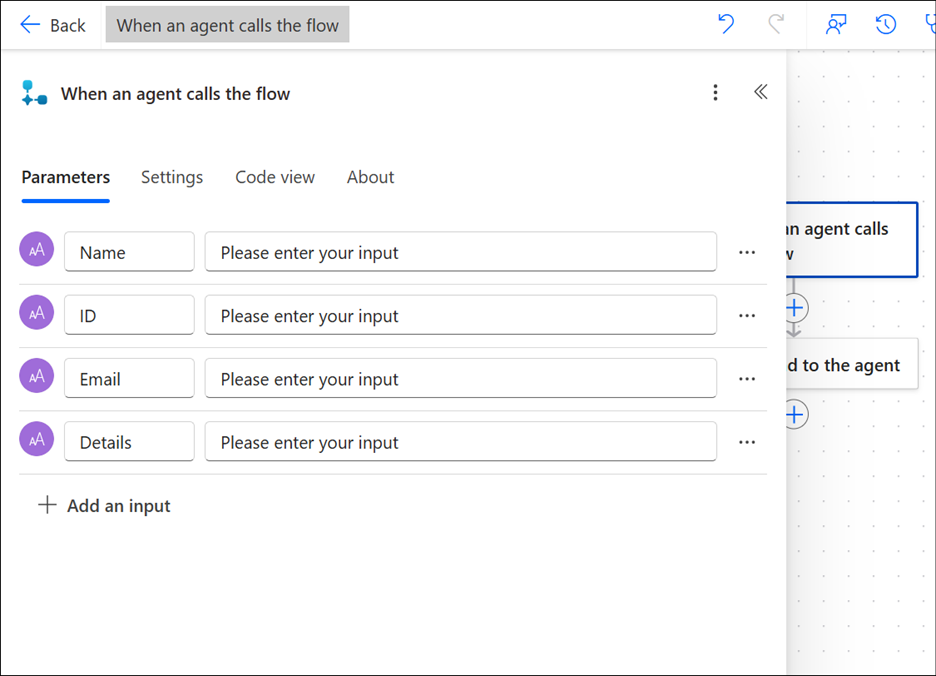

7.  Below **When an agent calls the flow**, click on **(+)** sign
    to **Add an action**.

    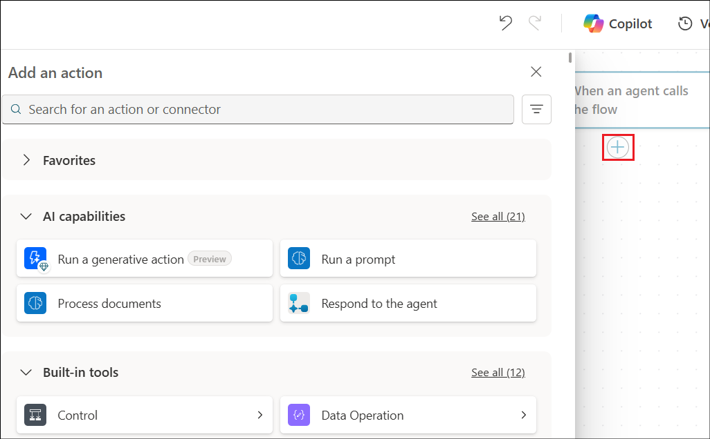

8.  In Add an action search bar, enter +++Add a new row+++ . Then
    select **Add a new row** from Microsoft Dataverse section.

    

    [!note] **Note:** Sometimes, a Dataverse connection is not created
automatically. You may need to **sign in** again with your
credentials **OAuth** authentication. If a connection name is required,
name it +++connect+++. The browser may also block the initial pop up
window, please allow it in the right corner of the URL bar.

    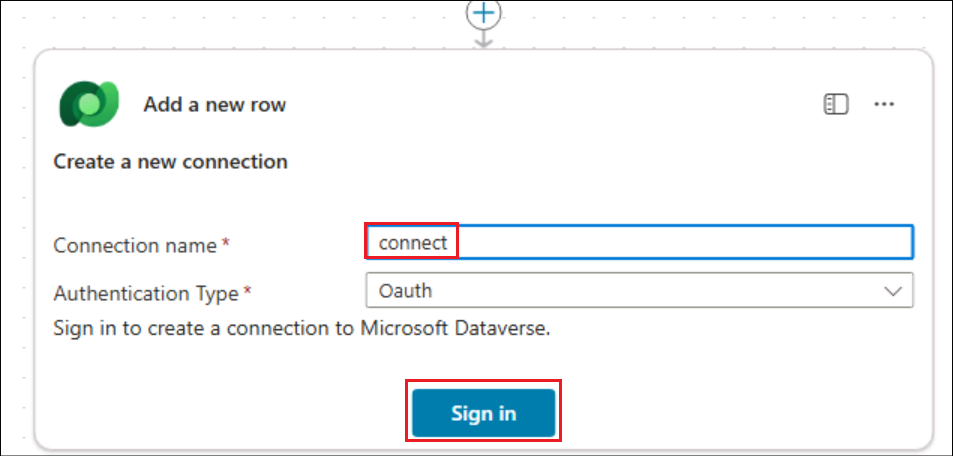

    

9.  In **Table Name** section search and select +++Employee Support
    Ticket+++ (or your corresponding table name created).

    

10. Below table name select **Show all**, then click on the particular
    field and add **input** with the help of **dynamic content** button
    (**Thunder bolt**) as per the below table.

    Set the **Current Status** field to **Unresolved**.

    |  **Section** | **Input Variable**  |
    |:------|:--------|
    |Employee Name   |  Name (Dynamic Input) |
    | Email Address  | Email (Dynamic Input)  |
    |  Employee ID | ID (Dynamic Input)  |
    |  Technical Issue Description |  Details (Dynamic Input) |

    

    

11. From the top bar click on **Save draft** and then
    click **Publish**. **Close** the Power automate tab.

    

12. Select the **Overview** tab.

    

13. Select **Edit** under **Details**, in the flow.

    

14. Name the flow as +++Create an Employee Support Ticket+++ and
    select **Save**.

    

    

15. From the **Contoso IT Support Agent** **Overview** page, select **+
    Add tool**.

    

16. Select the **Flows** tab and select **Create an Employee Support
    Ticket** Agent flow.

    

17. Select **Add and configure** button to add the flow.

    

18. Ensure that the **tool** is **added** to the agent.

    

**Conclusion**

By completing this exercise, participants will learn:

- How to integrate Agent flows with a Copilot agent for ticket creation.

- Steps to collect and map input data dynamically from user
  interactions.

- Techniques to automate email notifications for technical issue
  escalation.

- The ability to configure workflows for efficient support ticket
  management.

## **Exercise 6: Configuring a trigger for Automated Actions**

This continuation of automating support ticket creation focuses on
setting up a trigger in the Contoso IT Support Agent. Create
a **Team** and a **Support Channel** in the MS Teams. When there is a
message posted in the Support Channel, the trigger should get invoked.
Participants will configure triggers and finalize the agent for
deployment.

1.  Open a browser and open Teams
    +++https://teams.microsoft.com/+++ in it. Login if prompted.

2.  Select the **New items** icon and select **New Team**.

    

3.  Enter the below details and select **Create**.

    - Team name - +++Support Team+++

    - Description - +++This is a team to post about support requests.+++

    - First channel name - +++Support Channel+++

    

4.  Select **Skip** in the Add members screen.

    

5.  From the Copilot Studio - overview page of the agent, scroll down
    and click on **+ Add trigger**.

    

6.  Select **When a new channel message is added** trigger and
    click **Next**.

    

7.  Once the connection establishment is successful, select **Next**.

    

8.  Select the below values and select Create trigger.

    - Team - **Support Team**

    - Channel - **Support Channel**

    

9.  **Close** the Time to test your trigger dialog.

    

10. **Publish** the agent by selecting the **Publish** button from the
    top right.

11. From the **Overview** page of the agent, select the three dots next
    to the added trigger - **When a new channel message is added** and
    select **Edit in Power Automate**.

    

12. Select the + symbol below the **When a new channel message is
    added** node to add an action. In the Action pane, search for +++Get
    a row+++ and select **Get a row** under **Excel Online (Business)**.

    

    

13. Once the action is added, add the below details in it.

    - Location - Select OneDrive for Business

    - Document Library - OneDrive

    - File - ITSupport.xlsx

    - Table - Table1

    - Key Column - ID

    - Key Value - +++ID1234+++

    

14. Select the **Sends a prompt to the specified copilot for
    processing** node.

    Under Body/message, enter +++Run the flow Create an Employee Support
Ticket+++ then add the dynamic values, Name, ID, Email ID, Description
and Status. Then add +++along with a message "New record added to the
Employee Support table"+++

    It should look similar to the one in the screenshot below.

    

15. **Save** the flow.

## **Exercise 7: Test the agent**

1.  From the Power Automate flow, **When a new channel message is
    added**, select **Test**.

    

2.  Select the **Manually** option and select **Test**.

    

3.  Open your **Teams** and select **Post in channel** in the **Support
    Channel** team.

    

4.  Enter a message and select **Post**.

    

5.  Back in the Power Automate page, you can see that the flow has
    started execution and has passed.

    

6.  From the agent Overview page, select **Test Trigger** icon.

    

7.  Select the latest trigger and select **Start testing**.

    

8.  It executes the flow, fetches the data from the Support tracker and
    update in the Dataverse table.

    

    

9.  In this case, there is one support ticket detail in the tracker,
    which gets added to the Dataverse table hence creating a support
    ticket for the user.

**Final Conclusion of the Lab Guide**

This lab guide provided participants with a hands-on experience in
deploying an Autonomous Copilot Agent for Contoso Solutions' IT support
service desk. By following the step-by-step exercises, participants were
able to:

1.  **Set Up Copilot Studio**: Participants learned how to log into
    Copilot Studio, create and configure the IT support agent, and
    enable essential settings like generative AI and orchestrator for
    effective troubleshooting and ticket automation.

2.  **Navigate Power Apps**: Participants gained practical knowledge in
    logging into Power Apps, setting up a Dataverse table, and importing
    data from Excel to track and manage support tickets efficiently.

3.  **Enhance Bot Capabilities**: The exercises focused on adding a
    knowledge base to the bot, customizing the conversation start and
    fallback topics to improve user interaction, and ensuring the bot
    could handle a wide range of IT support scenarios.

4.  **Automate IT Support Tasks**: Participants also learned how to
    automate the creation of support tickets using Power Automate,
    enhancing the bot's capability to manage unresolved issues and
    improve IT team workflows.

By completing these exercises, participants were able to implement a
robust autonomous support system that improves response times, reduces
manual workload, and enhances overall productivity for IT support
operations. The integration of Copilot Studio, Power Apps, and Dataverse
ensures a seamless flow of information, automates routine tasks, and
optimizes support workflows, providing immediate troubleshooting
solutions to employees and automated ticket management for unresolved
issues.
